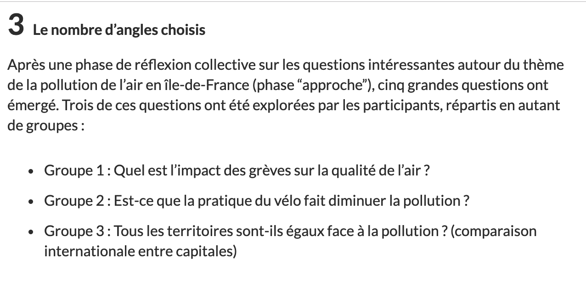
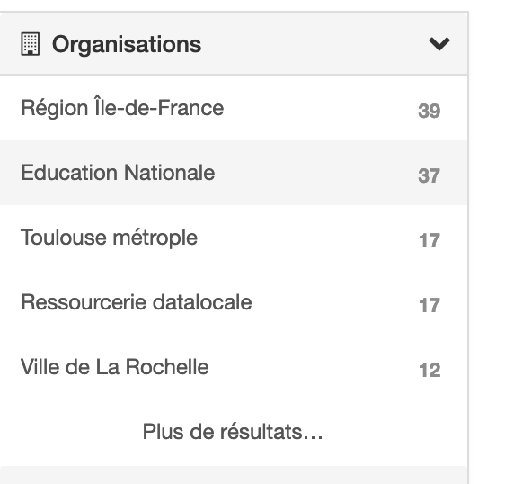
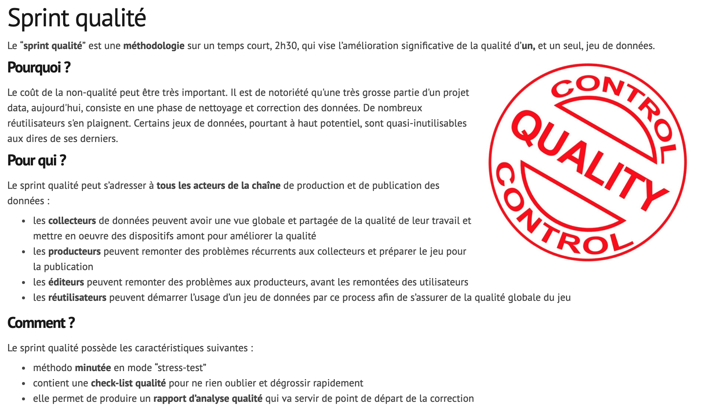

class: center, middle

#### These slides online: `r paste0("http://datactivist.coop/", params$slug)`

Source: `r paste0("https://github.com/datactivist/", params$slug)`

Datactivist's work is freely reusable licenced under [Creative Commons 4.0 BY-SA](https://creativecommons.org/licenses/by-sa/4.0/legalcode.fr).

 
 

---

### The Data Pipeline

.pull-left[
.reduite[

]
]
.pull-right[
We will follow the [Data Pipeline](http://schoolofdata.org/methodology) methodology developed by the [School of Data](https://schoolofdata.org/). 

* A generic methodology for the discovery and use of open data

* 7 steps which, depending on the projects, are more or less important. 

]

---

### Define

.pull-left[
.reduite[

]
]
.pull-right[

###### Define your problem precisely

###### What are you trying to understand?

##### What data would you need?

]

---

## To define is to find an angle about your topic

.footnote[]

---

### Find

.pull-left[
.reduite[]

]
.pull-right[

##### Use special search operators

##### Search on open data portals

##### Use facets to find the right data

##### Extract data from OpenStreetMap

##### Rely on [data curation resources]  (https://teamopendata.org/t/curation-de-donnees-data-is-plural/734)
]

---
## Use special search operators

Exemple with a "site:education.gouv.fr filetype:xlsx" :

---
### Use facets to find the right data

.pull-left[

]

.pull-right[
Facets are filters in metadata. 

For example, they allow you to select only a certain producer. 

This can save a lot of time in a data search.
]
---
### Use facets to find the right data

.pull-left[
Without a facet filter, at the schools' request, we have surprising results on the first page like these FEMIS data.
]

.pull-right[
By keeping only "Education nationale" in the organization facet, we ensure that we find national data. 
]

---
### Using Google Dataset Search

Google has been offering this[search engine](https://toolbox.google.com/datasetsearch) for some time now, which aggregates a large number of open data portals. The results are uneven but the engine is still new...

---
### Search the [OpenDataSoft data network](https://data.opendatasoft.com)

OpenDataSoft references all data sets published on all its portals. Among them, the Public portal refers to data sets that cannot be found elsewhere, such as the [location of speed radars](https://data.opendatasoft.com/explore/dataset/radars%40public/table/). 

---
### Find the right tag on OSM
The "[Map Features](https://wiki.openstreetmap.org/wiki/Map_Features)" page on the OSM wiki lists all the tags used in the database. 

.footnote[More info: https://datactivist.coop/atelier-osm/]

---
### Use [data curation resources](https://teamopendata.org/t/curation-de-donnees-data-is-plural/734)

We have listed on [TeamOpenData](https://teamopendata.org/t/curation-de-donnees-data-is-plural/734) the best data curation resources. A search will help you find international data that you would not otherwise find. 

For example, the excellent [Data Is Plural Newsletter](https://tinyletter.com/data-is-plural/) provides a weekly presentation of the best datasets that are archived in a [spreadsheet](https://docs.google.com/spreadsheets/d/1wZhPLMCHKJvwOkP4juclhjFgqIY8fQFMemwKL2c64vk/edit#gid=0)

---
### Get 

.pull-left[
.reduite[

]
]

.pull-right[

- ###### Direct download

- ##### API or web service

- ##### Data scrapping

- ###### Copy / paste

- ##### Extraction (OpenStreetMap)

]

---
### Data scrapping: some tools

[import.io](https://import.io) is an excellent tool that makes it much easier to extract data from a website. The tool automatically detects the structure of the data on the site. 

.footnote[Loïc Haÿ has developed a [tutorial](https://www.dropbox.com/s/yarrneyseghd7d6/05-%20Extraire%20des%20donn%C3%A9es%20%C3%A0%20partir%20de%20pages%20web.pdf?dl=0) to use import.io.]

---
###  Data scrapping: some tools

The [WebScraper](https://webscraper.io/) extension for Chrome allows you to make complexe scrapping processes.

---
### Extract data from OSM

[Overpass-Turbo](overpass-turbo.eu) allows you to extract specific elements from the OpenStreetMap database. Example here with schools in the Yonne département: 

.footnote[More info: https://datactivist.coop/atelier-osm/]
---

## Verify 

.pull-left[
.reduite[

]]

.pull-right[

- ##### Common sense

- ##### Ask the source

- ##### Rely on communities of experts

- ##### Statistics

]

---
### Rely on the comments in data.gouv.fr

data.gouv.fr allows users to discuss data, this will help you to detect problems with the data. 

---
### WTFCSV to perform a quick data check

[WTFCSV](https://www.databasic.io/en/wtfcsv/) is a data mediation tool that provides an overview of your CSV files. 

---
### Clean 

.pull-left[
.reduite[]
]
.pull-right[

- #### Data cleaning

- ##### Edition

- #### Consolidation

- ###### Frequent errors
  - Format for dates
  - Duplicates
  - Spelling errors

]

---
### OpenRefine for cleaning data

[OpenRefine](http://openrefine.org/) is a powerful tool for exploring, transforming and reconciling data. 

<iframe width="560" height="315" src="https://www.youtube.com/embed/cO8NVCs_Ba0" frameborder="0" allow="accelerometer; autoplay; encrypted-media; gyroscope; picture-in-picture" allowfullscreen></iframe>

.footnote[Mathieu Saby has published a[complete tutorial] (http://opendata.maregionsud.fr/fileadmin/user_upload/tx_ausynews/ODL/ODL_OpenRefine_Marseille_2017-06-09-v2.pdf). ]

Translated with www.DeepL.com/Translator (free version)

---
### The [quality sprint](https://infolabs.io/sprint-qualite) to detect issues in the data

---
### The [Quartz Bad Data Guide](https://infolabs.io/sprint-qualite) : a summary of issues with data quality

---

### Analyse

.pull-left[
.reduite[

]
]

.pull-right[

#### Type of analysis
- Statistical analysis
- Spatial analysis

#### Tools

- Spreadsheet
- R
- QGIS (geo data)
- Etc.

]

---

### Present

.pull-left[
.reduite[]
]

.pull-right[

#### Communicate your work to your audience

Flourish
https://flourish.studio/

Datawrapper
https://www.datawrapper.de/

Infogram
https://infogram.com/

DIVE
https://dive.media.mit.edu/
]