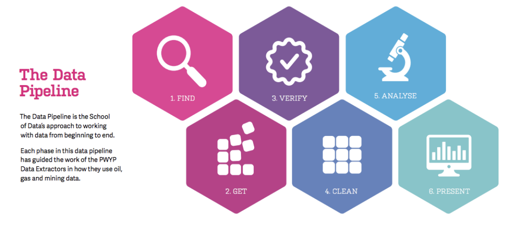

# Open Data for Urban Research

Master Governing the Large Metropolis

Sciences Po, urban school

Academic Year 2017/2018

## Instructors
- François Briatte	(ESPOL, Université Catholique de Lille)
- Samuel Goëta	(Datactivist)
- Joël Gombin	(Datactivist)

## Course Outline
This workshop offers a critical analysis of how urban-level data are produced, interpreted, and, increasingly, released to the public. It was designed specifically for this Masters, alongside the “Advanced Quantitative Methods” course, which enables students to build on their existing statistical training by mixing qualitative and quantitative insights.

Students will learn to assess the quality of existing open data resources, critically discuss their political implications, and produce their own catalogue of real-world public datasets.

In order to have a better understanding of the pitfalls of any open data project, we will follow the School of Data pipeline in this class which will allow us to review all the necessary steps in any open data project.  

## [Class 1 · Find and get data](http://datactivi.st/sciencespo_odur2017/class1/)

Slides: http://datactivi.st/sciencespo_odur2017/class1/
Date: Sept 20th 1PM -4PM
Instructor: Samuel Goëta

Reading:
- Harlan Yu and David G. Robinson, “The New Ambiguity of ‘Open Government’”[UCLA Law Review 59(178), 2012](https://www.uclalawreview.org/pdf/discourse/59-11.pdf)

## [Class 2 - Verify data](http://datactivi.st/sciencespo_odur2017/class2/#1)

Slides: http://datactivi.st/sciencespo_odur2017/class2/
Date: Oct 4th 1PM-4PM
Instructor: Samuel Goëta 

Reading: 
- David Ribes and Steven J. Jackson, “[Data Bite Man: The Work of Sustaining a Long-Term Study,](http://static1.1.sqspcdn.com/static/f/1070098/22175786/1363200724880/RibesJackson+-+Data+Bite+Man.pdf?token=QWR6lTGBtPNmiLqToDZCUWJkR3w%3D)” in Lisa Gitelman (ed.), ‘Raw Data’ is an Oxymoron, MIT Press, 2013, pp. 147–66.

## Class 3 - Clean Data
Date: Oct 25th 4PM-7PM

Instructor: Joël Gombin 

Readings:

- Garrett Grolemund and Hadley Wickham, “Tidy Data”[In R for Data Science, 2017, ch. 12](http://r4ds.had.co.nz/tidy-data.html)
- OKFN, "[Open data quality – the next shift in open data?](https://blog.okfn.org/2017/05/31/open-data-quality-the-next-shift-in-open-data/)"

## Class 4 - Present data
Date: Nov 23rd 4PM-7PM

Instructor: Francois Briatte

Readings:
- Wendy N. Espeland and Mitchell L. Stevens, “A Sociology of Quantification”[European Journal of Sociology 49(3): 401–36, 2009](https://www.researchgate.net/publication/231852216_A_Sociology_of_Quantification)
- Kieran Healy and James Moody, “Data Visualization in Sociology”[Annual Review of Sociology 40:105–28, 2014](https://kieranhealy.org/files/papers/data-visualization.pdf) 

Links

- Kieran Healy, Data Visualization for Social Science[socviz.co](http://socviz.co/)
- Severino Ribecca, “The Data Visualization Catalogue”[datavizcatalogue.com](http://www.datavizcatalogue.com/)
- Financial Times, “Visual Vocabulary. Designing with Data” [ft-interactive.github.io/visual-vocabulary](http://ft-interactive.github.io/visual-vocabulary/)

## Bibliography
⚠Needs some sorting 

### ARTICLES
Davies, Tim. 2010. “[Open Data, Democracy and Public Sector Reform. A Look at Open Government Data Use from data.gov.uk](http://practicalparticipation.co.uk/odi/report/wp-content/uploads/2010/08/How-is-open-government-data-being-used-in-practice.pdf).”

Desrosières, Alain. 2014. “[Statistics and Social Critique.](http://siba-ese.unisalento.it/index.php/paco/article/view/14157)” Partecipazione e Conflitto 7(2): 348–59.

Didier, Emmanuel. 2017. “[The Birth of Information Policing Between Management and Stat-activism](https://www-annualreviews-org.acces-distant.sciences-po.fr/doi/10.1146/annurev-soc-060116-053308).” Annual Review of Sociology 43, forthcoming.

Goëta, Samuel and Davies, Tim. 2016. “[The Daily Shaping of State Transparency: Standards, Machine-Readability and the Configuration of Open Government Data Policies](http://ojs.tsv.fi/index.php/sts/article/view/60221),” Science & Technology Studies 29(4).

Goldstein, Harvey. 2014. “[Using League Table Rankings in Public Policy Formation: Statistical Issues](http://www.annualreviews.org/doi/abs/10.1146/annurev-statistics-022513-115615),” Annual Review of Applied Statistics 1: 385–99.

Hacking, Ian. 1991. “How Should We Do the History of Statistics?” In: Burchell, Graham, Gordon, Colin and Peter Miller (eds), [The Foucault Effect. Studies in Governmentality](http://www.press.uchicago.edu/ucp/books/book/chicago/F/bo3684463.html). Chicago, Chicago University Press, pp. 181–96.

Erkkilä, Tero, Peters, B. Guy and Piironen, Ossi. 2016. “[Politics of Comparative Quantification: The Case of Governance Metrics](http://www.tandfonline.com/doi/full/10.1080/13876988.2016.1145871),” Journal of Comparative Policy Analysis 18(4): 319–438. Introduction to a special issue on “[Governance Indices, Politics and Expert Knowledge](http://www.tandfonline.com/toc/fcpa20/18/4).”

Le Bourhis, J.-P. 2016. “[The Politics of Green Knowledge: A Comparative Study of Support for and Resistance to Sustainability and Environmental Indicators](http://www.tandfonline.com/doi/full/10.1080/13876988.2015.1023054),” Journal of Comparative Policy Analysis 18(4): 403–18.

Oliver, Thomas R. 2010. “[Population Health Rankings as Policy Indicators and Performance Measures](http://www.cdc.gov/pcd/issues/2010/sep/10_0040.htm),” Preventing Chronic Disease 7(5): A101.

Raman, Nithya V. 2012. [“Collecting Data in Chennai City and the Limits of Openness.](http://ci-journal.net/index.php/ciej/article/view/877/908)” Journal of Community Informatics 8(2).

Sassen, Saskia. 2012. “[Urbanising Technology.](http://ec2012.lsecities.net/newspaper/articles/urbanising-technology/en-gb/)” The Electric City.

Sauder, Michael and Wendy Espeland. 2009. “[The Discipline of Rankings: Tight Coupling and Organizational Change](http://asr.sagepub.com/content/74/1/63.full.pdf)”, American Sociological Review 74(1): 63–82 [[summary](https://www.insidehighered.com/news/2009/02/03/rankings)].

Yu, Harlan and David G. Robinson. 2012. “[The New Ambiguity of ‘Open Government’](http://papers.ssrn.com/sol3/papers.cfm?abstract_id=2012489)”, UCLA Law Review: Discourse 59(178).

### BOOKS

Berns, Thomas. 2009. Gouverner sans gouverner. Une archéologie politique de la statistique. Paris, Presses Universitaires de France.

Bouk, D. 2015. [How Our Days Became Numbered. Risk and the Rise of the Statistical Individual](http://www.press.uchicago.edu/ucp/books/book/chicago/H/bo20298894.html). Chicago: University of Chicago Press.

Bruno, Isabelle, Didier, Emmanuel, and Prévieux, Julien. 2014. [Statactivisme. Comment lutter avec des nombres.](http://www.editionsladecouverte.fr/catalogue/index-Statactivisme-9782355220548.html) Paris, La Découverte.

Bruno, Isabelle, Jany-Catrice, Florence, Touchelay, Beatrice (eds). 2016. [The Social Sciences of Quantification. From Politics of Large Numbers to Target-Driven Policies](https://www.springer.com/us/book/9783319439990). New York, Springer.

Davis, Kevin E. et al. (eds). 2015. [Governance by Indicators: Global Power through Quantification and Rankings](https://global.oup.com/academic/product/governance-by-indicators-9780199658244?cc=fr&lang=en&). Oxford, Oxford University Press.

Desrosières, Alain. 1993. [La raison des grands nombres. Histoire de la raison statistique.](http://www.editionsladecouverte.fr/catalogue/index-La_politique_des_grands_nombres-9782707165046.html) Paris, La Découverte [[English translation](http://www.hup.harvard.edu/catalog.php?isbn=9780674009691)].

Desrosières, Alain. 2008. [Pour une sociologie historique de la quantification. L’argument statistique I](http://books.openedition.org/pressesmines/901). Paris, Presses de l’École des mines.

Desrosières, Alain. 2008. [Gouverner par les nombres. L’argument statistique II](http://books.openedition.org/pressesmines/341). Paris, Presses de l’École des mines.

Desrosières, Alain. 2014. [Prouver et gouverner. Une analyse politique des statistiques publiques](http://www.editionsladecouverte.fr/catalogue/index-Prouver_et_gouverner-9782707182494.html) Paris, La Découverte.

Gitelman, Lisa (ed.). 2013. [‘Raw Data’ is an Oxymoron](https://mitpress.mit.edu/books/raw-data-oxymoron). Cambridge, MIT Press.

Goëta, Samuel. 2016. [Instaurer des données, instaurer des publics : une enquête sociologique dans les coulisses de l'open data](http://www.theses.fr/2016ENST0045). PhD dissertation, Télécom ParisTech.

Jay Gould, Stephen. 1981. [The Mismeasure of Man](http://books.wwnorton.com/books/The-Mismeasure-of-Man/). New York, W. W. Norton.

Jerven, Morten. 2013. [Poor Numbers. How We Are Misled by African Development Statistics and What to Do about It](http://mortenjerven.com/poornumbers/). Ithaca, Cornell University Press.

Kitchin, Rob. 2014. [The Data Revolution. Big Data, Open Data, Data Infrastructures and Their Consequences](http://www.uk.sagepub.com/books/Book242780?subject=F00&fs=1#tabview=toc). London, Sage.

Mary, Sally E., Davis, Kevin E., and Benedict Kingsbury (eds). 2015. [The Quiet Power of Indicators: Measuring Governance, Corruption, and Rule of Law](http://www.cambridge.org/us/academic/subjects/law/socio-legal-studies/quiet-power-indicators-measuring-governance-corruption-and-rule-law). Cambridge, Cambridge University Press.

O’Neil, Cathy. 2016. Weapons of Math Destruction: How Big Data Increases Inequality and Threatens Democracy. New York, Crown.

Ogien, Albert. 2013. Désacraliser le chiffre dans l'évaluation du secteur public. Paris, Quae éditions.

Porter, Theodore. 1995. [Trust in Numbers. The Pursuit of Objectivity in Science and Public Life.](http://press.princeton.edu/titles/5653.html) Princeton, Princeton University Press.

Rottenburg, Richard, Merry, Sally E. and Sung-Joon Park (eds). 2015. [The World of Indicators: The Making of Governmental Knowledge through Quantification](http://www.cambridge.org/us/academic/subjects/law/socio-legal-studies/world-indicators-making-governmental-knowledge-through-quantification). Cambridge, Cambridge University Press.

Scott, James C. 1990. [Seeing Like A State. How Certain Schemes to Improve the Human Condition have Failed](http://yalebooks.com/book/9780300078152/seeing-state). Yale, Yale University Press.

Seybolt, Taylor B. 2013. [Counting Civilian Casualties. An Introduction to Recording and Estimating Nonmilitary Deaths in Conflict](https://global.oup.com/academic/product/counting-civilian-casualties-9780199977307)

Siracusa, Jacques. 2014. Rendre comptes. Un examen critique des usages de la quantification en sociologie. Paris, Hermann.

Supiot, Alain. 2015. [La Gouvernance par les nombres.](http://www.fayard.fr/la-gouvernance-par-les-nombres-9782213681092) Paris, Fayard.

Touchelay, Béatrice and Verheyde, Philippe (eds). 2009. La genèse de la décision. Chiffres publics, chiffres privés dans la France du XXe siècle. Paris, Éditions Bière.

Vatin, François (ed.). 2013. Évaluer et valoriser : Une sociologie économique de la mesure. Toulouse, Presses Universitaires du Mirail.

Wagner, Nancy L. 2016. [Behind the Scenes with Data at the IMF: An IEO Evaluation](http://www.ieo-imf.org/ieo/pages/CompletedEvaluation261.aspx). Washington DC:  International Monetary Fund Independent Evaluation Office.

Woolf, Harry. 1961. Quantification: A History of the Meaning of Measurement in the Natural and Social Sciences. Indianapolis, Bobbs-Merrill.

### BLOGS

Impact of Social Sciences Blog, London School of Economics and Political Science:

- [Philosophy of Data Series](http://blogs.lse.ac.uk/impactofsocialsciences/category/data-series/) 
- [Politics of Data Series](http://blogs.lse.ac.uk/impactofsocialsciences/the-politics-of-data-series/) 

Open Knowledge Foundation:

- [Open Knowledge International Blog](http://blog.okfn.org/) 
- [School of Data Blog](http://schoolofdata.org/blog/) 

### WEBSITES

- [LearnOpenData](https://github.com/cmfg/LearnOpenData/) (by Claire Foulquier-Gazagnes, from [Etalab](http://www.etalab.gouv.fr/)) 
- [Open Data Institute](http://theodi.org/) (London) 
- [Open Knowledge International](https://okfn.org/) 

Urban-level data-oriented studies:

- [Atlas of Urban Expansion](http://atlasofurbanexpansion.org/) 
- [EURO-URHIS2](http://results.urhis.eu/) – European Urban Health Indicators Systems Part 2 
- [US City Open Data Census](http://us-city.census.okfn.org/) 

Urban Audit – European City Statistics:

- [Eurostat resources, European Commission](http://ec.europa.eu/eurostat/web/cities) 
- [Office of National Statistics, United Kingdom](http://webarchive.nationalarchives.gov.uk/20160105160709/http://www.ons.gov.uk/ons/guide-method/user-guidance/urban-audit/index.html) (archive) 

OECD – Organization for Economic Cooperation and Development:

- [Urban Development](https://www.oecd.org/gov/regional-policy/urbandevelopment.htm) 
- [Metropolitan eXplorer](http://measuringurban.oecd.org/) 

UN-Habitat, United Nations:

- [Open UN-Habitat](http://open.unhabitat.org/) 
- [UN-Habitat Urban Data](http://urbandata.unhabitat.org/)
