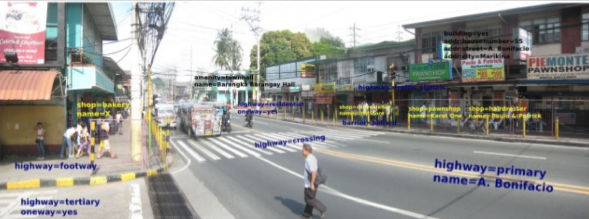
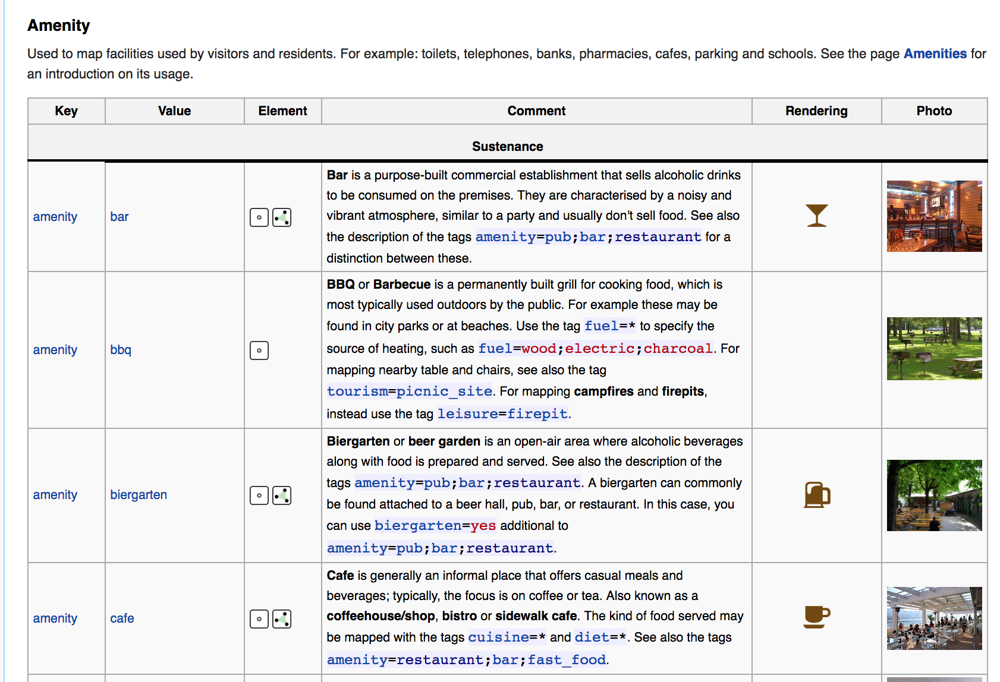
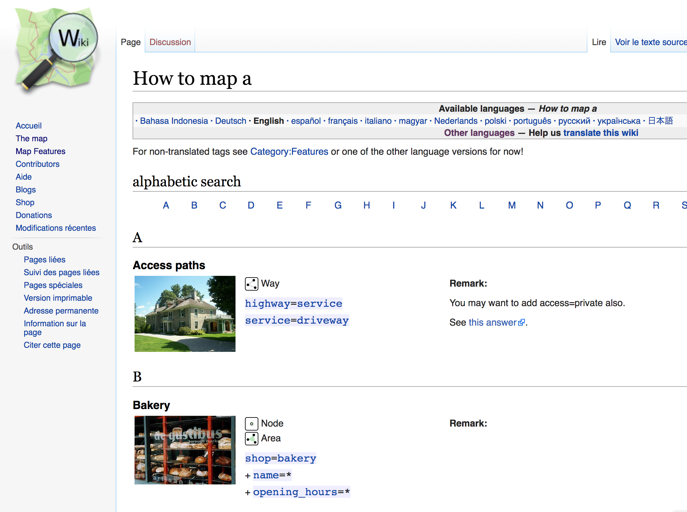
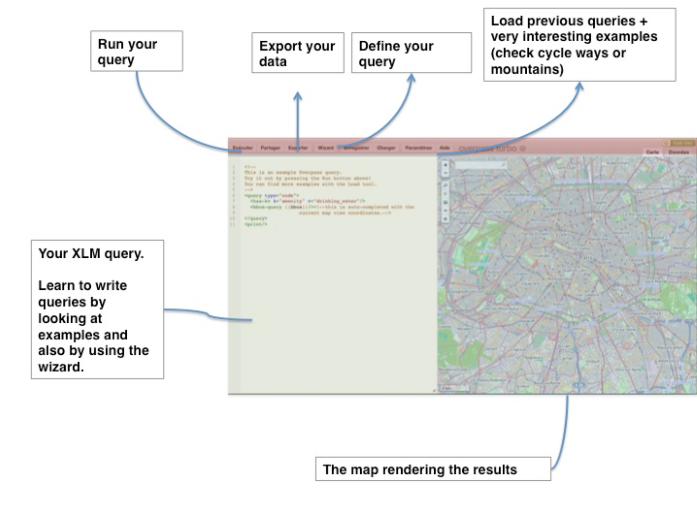
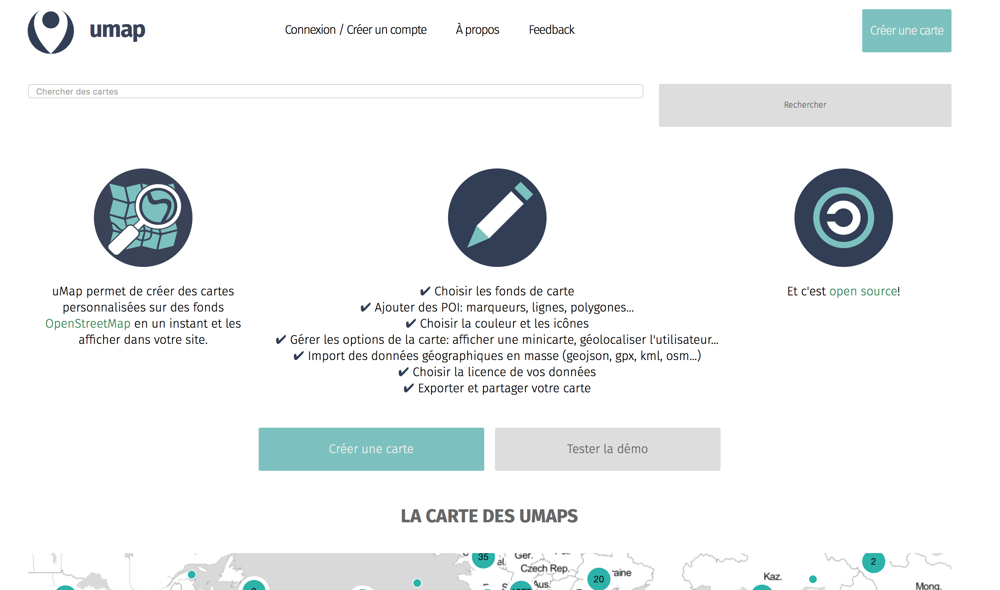
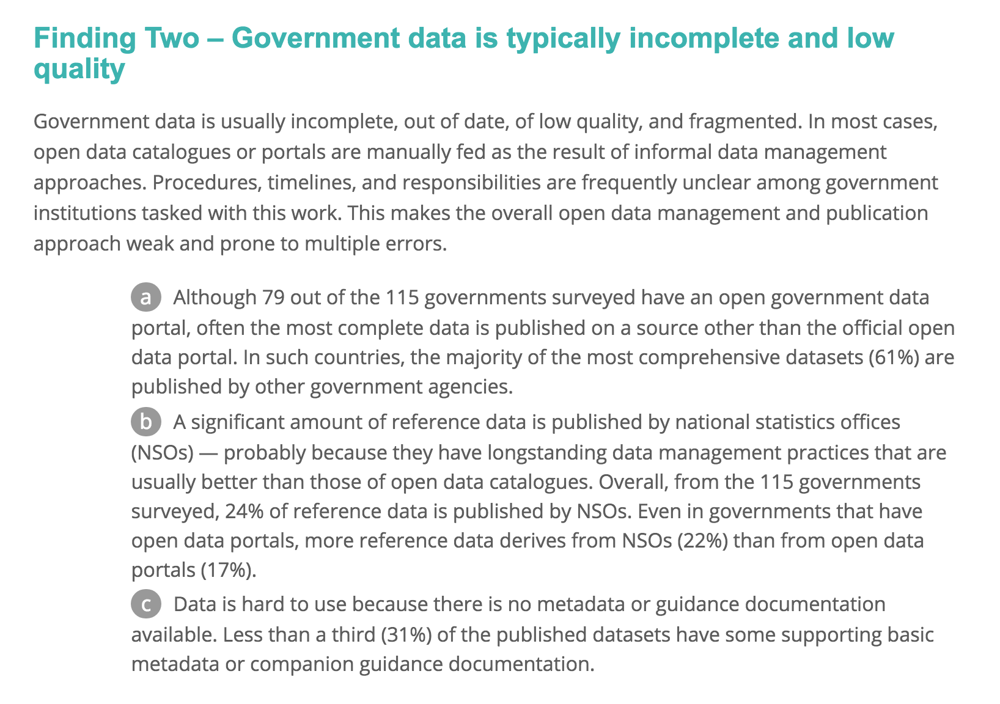
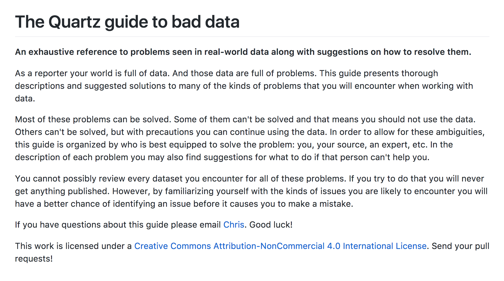
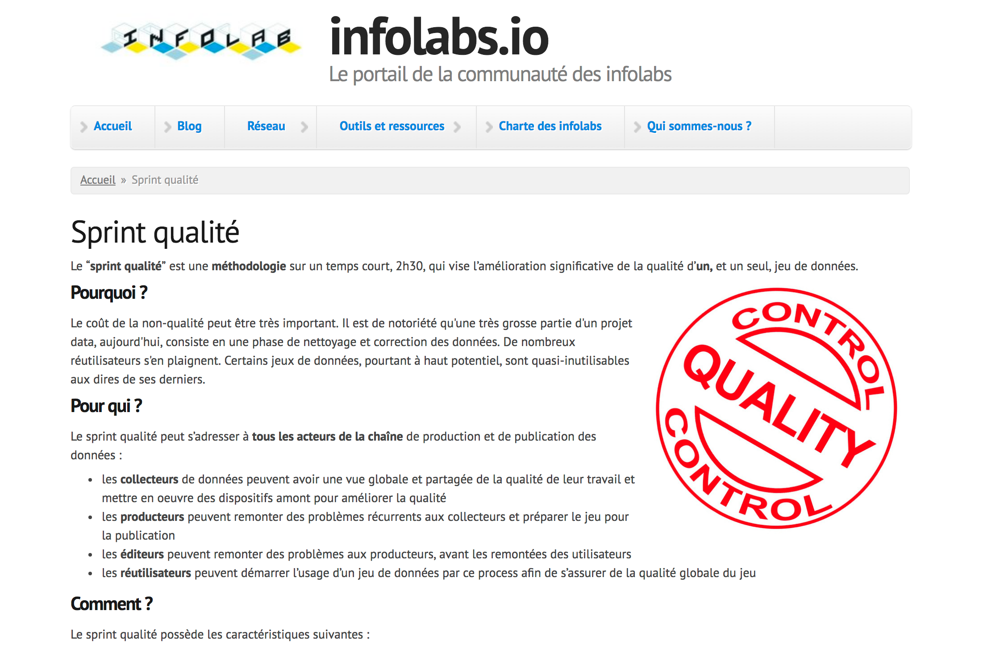
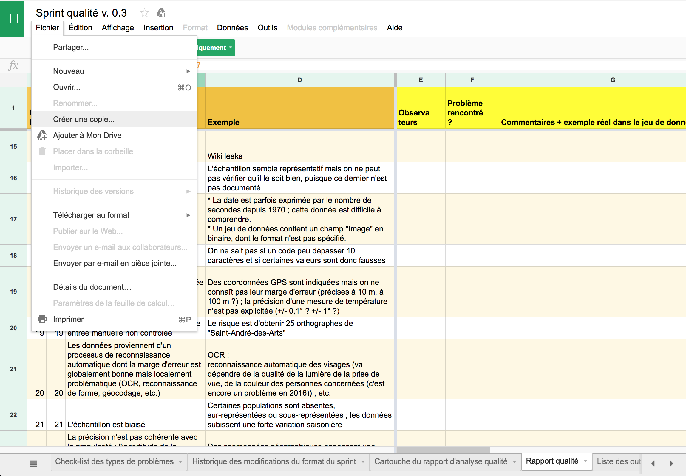
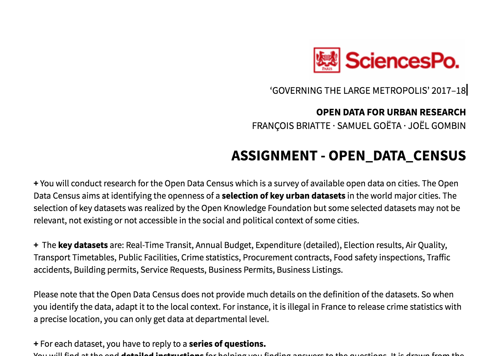

class: center, middle

Find the course materials on Github https://github.com/datactivist/sciencespo_odur2017/

These slides online: http://datactivi.st/sciencespo_odur2017/class2/

Content created by Datactivist is placed under [Creative Commons CC-BY-SA licence](https://creativecommons.org/licenses/by-sa/3.0/deed.fr). 

---
class:center, middle

#Teach what you learn!
Origins of open data

Freedom of Information: differences with open data

Principles of open data

Ways of getting data 

---
#Objectives of this course
.pull-left[

- Learn how to assess a dataset

- Discover how to check data quality

- Understand your assignment
]
.pull-right[

]
---
#Update on the course
.pull-left[
**Class 1 (17/09/20 - Samuel Goëta)** FIND and GET data

**Class 2 (17/10/04 - Samuel Goëta)** VERIFY data

**Class 3 (17/10/25 - Joël Gombin)** CLEAN data

** Class 4 (date TBC - François Briatte)** VERIFY and PRESENT data
]
.pull-right[

]
---
class:inverse, middle, center
# But before that…
## Getting data from OSM
---
#Objects in OpenStreetMap
.reduite2[.center[]]
.footnote[CC BY-SA esambale on slideshare]
---
#A world of tags
.reduite[.center[]]
.footnote[CC BY-SA esambale on slideshare]
---
#TAG 101 : KEY=VALUE
.reduite2[.center[]]
.footnote[CC BY-SA esambale on slideshare]
---
##« Map features » : the bible for tags
.reduite2[.center[]]
.footnote[http://wiki.openstreetmap.org/wiki/Map_Features]
---
## How to map a ... ? 
.reduite2[.center[]]
.footnote[http://wiki.openstreetmap.org/wiki/How_to_map_a]
---
## Exercise : find the following tags
.pull-left[

1. Highway 

2. Bicycle path

3. Museum

4. Airport

5. Bakery

]

---
## Solution : trouver les tags suivants
.pull-left[

1. Highway 

2. Bicycle path

3. Museum

4. Airport

5. Bakery
]
.pull-right[
1. Highway=motorway 

2. highway=cycleway or cycleway=*

3. Tourism=museum

4. Aeroway=aerodrome

5. Shop=bakery]
---
##👋Overpass
.reduite[]
.footnote[http://overpass-turbo.eu]
---
#Exercise : map the following elements

* Bakeries in Auxerre

* Bicycle paths in Poitiers

* Airports in Provence Alpes Cote d'Azur

* Mailboxes in Aix en Provence

* Electrical lines in Corsica
---
#Umap: make a quick map with OSM data
.reduite[]
.footnote[http://http://umap.openstreetmap.fr]

---
class:inverse, middle, center
# Verify data
---
#Verify
.pull-left[

> We got our hands in the data, but that doesn’t mean it’s the data we need. We have to check out if details are valid, such as the meta-data, the methodology of collection, if we know who organised the dataset and it’s a credible source. We’ve heard a joke once, but it’s only funny because it’s true: **all data is bad, we just need to find out how bad it is**!

.footnote[https://schoolofdata.org/methodology/]
]

.pull-right[

]
---
# ODB: the issue of government data quality 
.pull-left[
>**Government data is usually incomplete, out of date, of low quality, and fragmented.** In most cases, open data catalogues or portals are manually fed as the result of informal data management approaches. **Procedures, timelines, and responsibilities are frequently unclear among government institutions tasked with this work.**
.footnote[http://opendatabarometer.org/4thedition/report/]
]
.pull-right[

]
---
#GODI: the issue of data findability
.pull-left[
> Data findability is a major challenge. We have data portals and registries, but government agencies under one national government still publish data in different ways and different locations. Moreover, they have different protocols for license and formats(…)
**Data findability is a prerequisite for open data to fulfill its potential and currently most data is very hard to find.**
]
.pull-right[

.footnote[https://index.okfn.org/insights/]
]
---
class:inverse, middle, center
#How to check quality of the data?
---

.footnote[https://github.com/Quartz/bad-data-guide]
---

.footnote[http://infolabs.io/sprint-qualite]

---
# FING: data quality sprint 🏃

**Why ?**
Non-quality of data has a high cost. It is notorious that 80% of a data scientist workload consists of data wrangling. Lots of high potential datasets are merely unusable. 

**For whom?**
All the actors in the data pipeline:
- collectors: have an overview of issues and launch initiatives to improve quality
- producers: gain feedback on data quality, improve data before publication
- project owners: anticipate issues reusers will encounter
- reusers: check the quality before starting a data project

**How?**
A "stress-test for data with a checklist and a template for reporting issues. 
---
# Let's give it a try with Paris data

--- 
# A collaborative translation

The quality sprint is only in English, we will translate it collaboratively and release the result. 

**How?** 
- I created a [Google spreadsheet](https://docs.google.com/spreadsheets/d/1sWX8tYmE_4JnLTiNAaxsvNFbR4WO0XZXJ37RQW3cjeQ/edit#gid=678479114) copy of the original document.

- Each of you will translate 10 lines **in the report** (tab "rapport qualité") before next class

- Assign yourselves in Basecamp 
---
class:center, middle, inverse
# Assignments
---
# Assignment 1 : Open Data Census 

---
# Assignment 2: Quality Data Sprint for a dataset

.footnote[More instructions will follow on Basecamp]
---

---
class:inverse,middle,center
# Thanks
