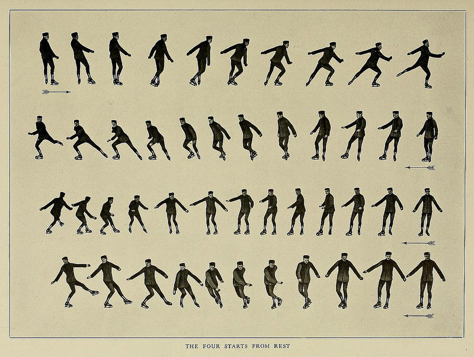

class: center, middle

Find the course materials on Github : https://github.com/datactivist/sciencespo_odur2018/

These slides online: https://datactivist.coop/sciencespo_odur2018/class3/

Content created by Datactivist is placed under a [Creative Commons 4.0 BY-SA licence](https://creativecommons.org/licenses/by-sa/4.0/legalcode.fr). 


---
#Objectives of this course
.pull-left[
- Learn what is open data: origins, principles, benefits, best practices 

- Discover how to conduct an open data project

- Explore each step in any project with open data
]
.pull-right[

]
---
#Overview of the course
.pull-left[
**Class 1 (18/09/27 - Samuel Goëta)** FIND and GET data

**Class 2 (18/10/11 - Samuel Goëta)** VERIFY data

**Class 3 (18/10/24 - Joël Gombin)** CLEAN data

** Class 4 (18/11/08, 5-8pm - François Briatte)** PRESENT data
]
.pull-right[
]

---
# Today's course

- Cleaning data: why it matters

- Cleaning data: how it could be done

- Cleaning data: examples

---
class: center, middle, inverse 
# Cleaning data: why it matters

---
## Cleaning data: why it matters

- discoverability
- (re)usability

---
## Cleaning data: why it matters

> To date, it seems that opening this data has not reduced but rather shifted and multiplied the barriers to the use of data

[*OKFN*](https://blog.okfn.org/2017/05/31/open-data-quality-the-next-shift-in-open-data/)

---
## Cleaning data: why it matters

The new Babel tower

---
## Cleaning data: why it matters

Difficulty: no one is sure what "good quality" means exactly

---
## Cleaning data: why it matters

"Clean" or "tidy" data does not necessarily exist *per se* - you have to think about who the potential users their needs are.


---
## Cleaning data: the museum of horrors

[](http://opendata.regionpaca.fr/donnees/detail/traitement-des-dechets-de-mpm-synthese-de-2012-a-2014.html)

---
## Cleaning data: the museum of horrors

[](http://data.montpellier3m.fr/dataset/chiffres-cl%C3%A9s-des-m%C3%A9diath%C3%A8ques-de-montpellier-m%C3%A9diterran%C3%A9e-m%C3%A9tropole)

---
## Cleaning data: the museum of horrors


---
class: center, middle, inverse
# Cleaning data: how it could be done

---
## The tidy data framework

> “Happy families are all alike; every unhappy family is unhappy in its own way.” – Tolstoï

> “Tidy datasets are all alike, but every messy dataset is messy in its own way.” – Hadley Wickham


1. Each variable forms a column.

2. Each observation forms a row.

3. Each type of observational unit forms a table / Each cell has one and only one value. 

---
## The tidy data framework

```{r, echo = FALSE, out.width='90%', fig.align='center'}
knitr::include_graphics("./img/tidy-1.png")
``` 


---
## The tidy data framework

1. Each variable forms a column.

2. Each observation forms a row.

3. Each type of observational unit forms a table.

---
## Tidying data with R

Meet the tidyverse !

.center[]

---
## Tidying data with R

- the `tidyverse` metapackage

- `dplyr` and `tidyr`

- the pipe : `%>%` (Ctrl/Cmd + shift + M)

- the verbs : 
  + `filter` (and `slice`)
  + `arrange`
  + `select` (and `rename`)
  + `distinct`
  + `mutate` 
  + `group_by` 
  + `summarise`
  + `sample_n` / `sample_frac`

- the `stringr` package may be a useful companion (for strings manipulation / regex)


---
## Pivot

`gather` and `spread`

```{r, echo = FALSE, out.width='90%', fig.align='center'}
knitr::include_graphics("http://r4ds.had.co.nz/images/tidy-9.png")
```

---
## Pivot


```{r, echo=TRUE}

library(tidyverse)
pres2017T1_communes <- read_csv("./data/Presidentielle_2017_Resultats_Communes_T1_clean.csv",
                       na = "",
                       col_types = cols(
  .default = col_double(),
  CodeInsee = col_character(),
  CodeDepartement = col_character(),
  Département = col_character(),
  Commune = col_character(),
  Inscrits = col_integer(),
  Abstentions = col_integer(),
  Votants = col_integer(),
  Blancs = col_integer(),
  Nuls = col_integer(),
  Exprimés = col_integer(),
  `LE PEN` = col_integer(),
  MÉLENCHON = col_integer(),
  MACRON = col_integer(),
  FILLON = col_integer(),
  LASSALLE = col_integer(),
  `DUPONT-AIGNAN` = col_integer(),
  HAMON = col_integer(),
  ASSELINEAU = col_integer(),
  POUTOU = col_integer(),
  ARTHAUD = col_integer(),
  CHEMINADE = col_integer()
  )
)
```

---
## Pivot

```{r, echo=FALSE}
pres2017T1_communes
```

---
## Pivot

```{r}
library(tidyverse)
pres2017T1_communes_long <- pres2017T1_communes %>% 
  select(- contains("_ins")) %>%
  select(- contains("_exp")) %>%   
  gather(candidat, voix, `LE PEN`:CHEMINADE)

pres2017T1_communes_long
```

---
## Modify

```{r}
pres2017T1_communes_long <- pres2017T1_communes_long %>% 
  mutate(ins = voix / Inscrits * 100) %>% 
  mutate(exp = voix / Exprimés * 100) %>%
  print
```

---
## Pivot again

```{r}
pres2017T1_communes_long %>% 
  gather(metrique, valeur, voix:exp) %>% 
  glimpse
```

---
## Pivot again

```{r}
pres2017T1_communes_long %>% 
  gather(metrique, valeur, voix:exp) %>% 
  unite(variable, candidat, metrique, sep = "_") %>% 
  glimpse
```

---
## Pivot again

```{r}
pres2017T1_communes_long %>% 
  gather(metrique, valeur, voix:exp) %>% 
  unite(variable, candidat, metrique, sep = "_") %>% 
  spread(variable, valeur) %>% 
  glimpse
```


---
class: center, middle, inverse
# Cleaning data: examples

---
## French electoral data

https://github.com/joelgombin/LireMinInterieur

---
## A large project with plenty of different types of data

https://joelgombin.github.io/makingof

---
## A recent project of urban open data

https://github.com/CMARUE/APIs

